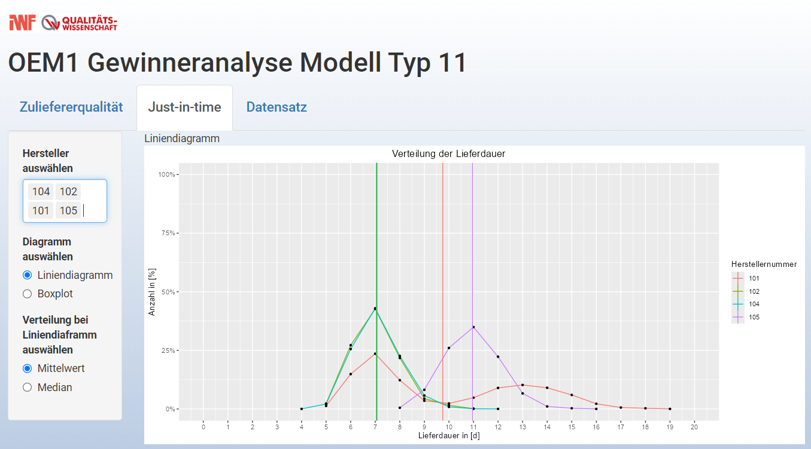
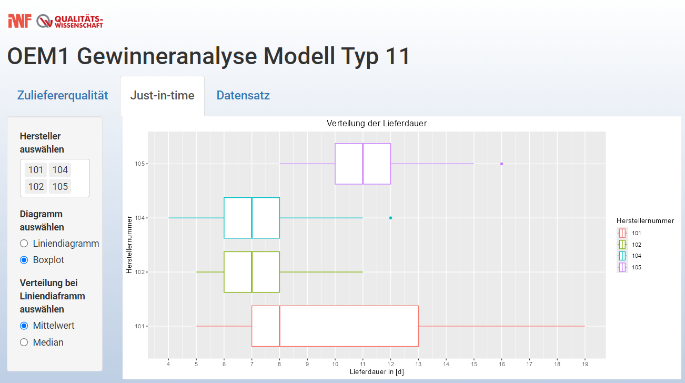

```{r setup, include=FALSE}
# install.packages("yaml")

library(yaml)
```
In diesem Dokument werden die Schritte und Abläufe der Case_Study_App_Gruppe_11.R Datei beschrieben und erklärt.
Die Themen Vorbereiten der Programmierumgebung, Importieren der Daten, Datenaufbereitung und Erstellen des finalen Datensatzes
wurden von Ida Kossatz bearbeitet und implementiert.
Die Shiny App und die Themen Auswertung und Ergebnis wurden von Minh Ngoc Hoang bearbeitet.
Die allgemeinen Aufgaben wurden von Alik Aylarov und Ange Adissin bearbeitet.

# Vorbereiten der Programmierumgebung
Um alle gewünschten Imports, Operationen und Anpassungen vornehmen zu können, wird das Tidyverse Package installiert und die Packages readr, dplyr, tidyr und stringr geladen.

```
install.packages("tidyverse")
library(readr)
library(dplyr) 
library(tidyr) 
library(stringr)
```


# Importieren der Daten
Um die Case Study bearbeiten zu können wurden folgende Datensätze importiert.
Dabei sind die Einzelteile zugehörig zu ihren jeweiligen Komponenten aufgelistet. Sollten Daten aus den Einzelteile Tabellen für unterschiedliche Komponenten genutzt werden, so werden diese einmalig beim ersten Aufruf importiert.
Da für die Aufgabe Einzelteile und Komponenten aus dem Fahrzeug Typ 11, gebaut von der Firma OEM1, gefragt sind, werden anhand der ersten drei Tabellen sowie der jeweiligen Bestandteile_Komponente_KomponentenID Tabellen die restlichen benötigten Dateien herausgesucht.

- Fahrzeuge_OEM1_Typ11
- Bestandteile_Fahrzeuge_OEM1_Typ11
- Fahrzeuge_OEM1_Typ11_Fehleranalyse
- Komponente_K1BE1
  - Bestandteile_Komponente_K1BE1
  - Einzelteil_T01
  - Einzelteil_T02
  - Einzelteil_T03
  - Einzelteil_T04
- Komponente_K1DI1
  - Bestandteile_Komponente_K1DI1
  - Einzelteil_T05
  - Einzelteil_T06
- Komponente_K2LE1
  - Bestandteile_Komponente_K2LE1
  - Einzelteil_T11
  - Einzelteil_T14
  - Einzelteil_T15
- Komponente_K2ST1
  - Bestandteile_Komponente_K2ST1
  - Einzelteil_T12
  - Einzelteil_T13
- Komponente_K3AG1
  - Bestandteile_Komponente_K3AG1 
  - Einzelteil_T21
  - Einzelteil_T24
  - Einzelteil_T25
- Komponente_K3SG1
  - Bestandteile_Komponente_K3SG1
  - Einzelteil_T22
  - Einzelteil_T23
- Komponente_K4
  - Bestandteile-Komponente_K4
  - Einzelteil_T30
  - Einzelteil_T31
  - Einzelteil_T32

Anhand folgender Beispiele wurden oben genannte Dateien importiert.


## Import Funktionen für unterschiedliche Dateitypen {.tabset}
Die unterschiedlichen Importbefehle werden jeweils anhand von Beispielen aus dem Originalcode gezeigt.

### .csv
CSV Dateien bei welcher die Spalten mit einem Komma separiert sind, werden wie folgt importiert. In diesem Fall wird die Datei Fahrzeuge OEM Typ 11 als Beispiel genutzt.
```
Fahrzeuge_OEM1_Typ11 <- read_csv(".\\Data\\Fahrzeug\\Fahrzeuge_OEM1_Typ11.csv")
```

CSV Dateien, bei welcher die Spalten dagegen mit einem Semikolon separiert sind, werden mit folgendem
Befehl importiert. Hier wird die Tabelle Bestandteile Fahrzeuge OEM1 Typ11 als Beispiel genutzt.
```
Bestandteile_Fahrzeuge_OEM1_Typ11 <- read_csv2(".\\Data\\Fahrzeug
                                                 \\Bestandteile_Fahrzeuge_OEM1_Typ11.csv ")
```

### .txt einzeilig
Einzeilige Text (.txt) Dateien werden zuerst als String eingelesen. Anschließend werden die Spalten Delimiter mit `\t` ersetzt und die Zeilen Delimiter mit `\n`. In diesem Fall wird die Datei Einzelteil_T01.txt als Beispiel genutzt.
```
Einzelteil_T01_str <- readLines(paste(".\\Data\\Einzelteil\\Einzelteil_T01.txt"), warn=FALSE)
Einzelteil_T01_str <- str_replace_all(Einzelteil_T01_str, "[|]", "")
Einzelteil_T01_str <- str_replace_all(Einzelteil_T01_str, "[[:space:]]{3}", "\t")
Einzelteil_T01_str <- str_replace_all(Einzelteil_T01_str, " \"", "\n\"")

```
Die Funktion mit der mehrzeilige .txt Dateien eingelesen werden können, braucht eine Datei als Input. Deswegen wird der eingelesene und angepasste String in eine temporäre Datei gespeichert. Um im weiteren Verlauf Tabellen mit gleichen Spaltennamen zu erhalten, werden die Spaltennamen im read_delim() Befehl mit festgelegt.
```
tf <- tempfile()
writeLines(Einzelteil_T01_str, tf)
Einzelteil_T01 <- read_delim(tf, col_names = c("ID", "X1", "ID_T1", "Produktionsdatum", 
                  "Herstellernummer", "Werksnummer", "Fehlerhaft", "Fehlerhaft_Datum", 
                  "Fehlerhaft_Fahrleistung"), skip = 1)
```                                               
Um Arbeitsspeicher zu sparen werden der eingelesene String und die temporäre Datei wieder gelöscht. Die brauchbare Tabelle wurde im vorhergehenden Schritt als Variable gespeichert.
```
rm(Einzelteil_T01_str, tf)
```

### .txt mehrzeilig
Da R bei mehrzeiligen .txt Dateien den Zeilenumbruch erkennt, muss nur der Spaltenumbruch festgelegt werden. Auch hier werden die Spaltennamen für einheitliches Arbeiten eigenständig festgelegt. In diesem Fall wird die Datei Komponente_k2ST1.txt als Beispiel genutzt.

```
Komponente_K2ST1 <- read_delim(".\\Data\\Komponente\\Komponente_K2ST1.txt", delim="|",
                               col_names = c("ID", "X1", "ID_Sitze", "Produktionsdatum", 
                               "Herstellernummer", "Werksnummer", "Fehlerhaft", 
                               "Fehlerhaft_Datum", "Fehlerhaft_Fahrleistung"), skip = 1)

```

# Datenaufbereitung

## Anpassen und Verbinden von Tabellen mithilfe von Funktionen
Da abschließend eine Tabelle mit allen benötigten Daten erstellt werden soll, müssen die benötigten Tabellen sortiert, gereinigt und miteinander verbunden werden.
Diese Befehle werden für jede Tabelle genutzt, deshalb bietet es sich an dies durch Funktionen zu definieren, welche dann nur noch aufgerufen werden müssen.
Dabei werden innerhalb der Funktion auch einzelne Spalten manipuliert und fehlerhafte Daten aussortiert, um anschließend einen sortierten Datensatz zu erhalten.
Die finale Tabelle soll aus allen benötigten Komponenten und Einzelteilen folgende Spalten beinhalten:

- Fehlerhafte Fahrleistung
- Betriebsdauer
- Herstellernummer
- ID-Self
- ID-Parent
- Lieferdauer
- Produktionsdatum

ID-Self beinhaltet dabei die ID des Einzelteils oder der Komponente und ID-Parent beschreibt bei Einzelteilen die ID der dazugehörigen Komponente, sowie bei Komponenten die dazugehörige ID des Fahrzeugs. Es wäre möglich diese zwei Attribute in eine Spalte mit einem Namen wie z.B. ID einzusortieren, da jeweils nur die Komponenten ID wirklich relevant ist, jedoch ist es übersichtlicher und leichter verständlich, wenn beide Attribute in separaten Spalten beibehalten werden. Die jeweiligen IDs sind für das Plotten der geforderten Graphen relevant.

### Funktionen zum Verbinden von Tabellen {.tabset}

#### "Transform" Funktion für Komponenten
Diese Funktion verbindet die Komponenten mit den Fahrzeugdaten dabei werden die benötigen Parameter extrahiert.
Das Argument "Join" ist ein String, da für die unterschiedlichen Komponenten wie z.B. Motoren oder Schaltungen, die Tabellen anhand von verschiedenen ID'S verbunden werden müssen.
Die Funktion filtert die Komponenten Datei nach Einträgen in der Fehlerhaft_Datum Spalte, da nur diese relevant für die Aufgabenstellung sind. Anschließend wird die Komponenten Datei mit der Fahrzeuge_OEM1_Typ11 Datei verbunden, dabei werden fehlerhafte Einträge aussortiert. Um die benötigte Angabe Lieferdauer zu erstellen werden für jeden Zeileneintrag das Produktionsdatum des Fahrzeuges abgezogen dem Produktionsdatum der Komponente berechnet und als Spalte mit dem Namen Lieferdauer der Tabelle hinzugefügt.
Danach werden die final benötigten Spalten selektiert und namentlich gegebenenfalls angepasst, um eine einheitliche Namensgebung zu gewährleisten.

```
Komponente_Transform <- function (Komponente, Join = ""){
  Komponente <- Komponente %>%
    filter(!is.na(Fehlerhaft_Datum)) %>%
    left_join(Fahrzeuge_OEM1_Typ11, by = Join) %>%
    drop_na() %>%
    mutate(Lieferdauer = Produktionsdatum.y - Produktionsdatum.x) %>%
    select(c(Fehlerhaft_Fahrleistung = Fehlerhaft_Fahrleistung, Betriebsdauer, 
             Herstellernummer, ID_Self = matches(Join) , ID_Parent = ID_Fahrzeug, 
             Lieferdauer, Produktionsdatum = Produktionsdatum.x))
}
```

#### "Transform" Funktion für Einzelteile
Diese Funktion verbindet die Einzelteile mit den Komponenten, dabei werden die benötigen Parameter extrahiert.
Das Argument "Join" ist auch hier ein String, da die ID für jedes Einzelteil anders ist.
Zuerst werden die beiden Tabellen verknüpft, dabei werden fehlerhafte Einträge aussortiert. Um die benötigte Angabe Lieferdauer zu erstellen werden für jeden Zeileneintrag das Produktionsdatum der Komponente abgezogen dem Produktionsdatum des Einzelteils berechnet und als Spalte mit dem Namen Lieferdauer der Tabelle hinzugefügt.
Danach werden die final benötigten Spalten selektiert und namentlich gegebenenfalls angepasst, um eine einheitliche Namensgebung zu gewährleisten.

```
Einzelteil_Transform <- function(Teil, Komponente, Join = ""){
  Teil <- Teil %>%
    left_join(Komponente, by=Join) %>%
    drop_na() %>%
    mutate(Lieferdauer = Produktionsdatum.y - Produktionsdatum.x) %>%
    select(c(Fehlerhaft_Fahrleistung = Fehlerhaft_Fahrleistung.x, Betriebsdauer, 
             Herstellernummer = Herstellernummer.x, ID_Self = matches(Join), 
             ID_Parent = ID_Self, Lieferdauer, Produktionsdatum = Produktionsdatum.x))
}
```

## Importieren, Anpassen und Speichern der Einzelteile und der Komponenten (Teil 1)
Zunächst wird der Ablauf beschreiben, welcher den Import, das Anpassen mit den oben beschriebenen Funktionen und das finale Speichern als Variable ausführt. Dies ist für jedes Einzelteil bzw. jede Komponente annähernd identisch und wird deshalb nur anhand einer Komponente beispielhaft beschrieben. In diesem Fall Komponente K1BE1.

1. Einlesen der Datei mithilfe der oben beschriebenen [Import Funktionen für unterschiedliche Dateitypen] .

```
Komponente_K1BE1 <- read_csv(".\\Data\\Komponente\\Komponente_K1BE1.csv")
```

2. Gegebenenfalls Anpassen der Tabelle, sodass die Spalten jeder Komponenten- bzw. Einzelteiltabelle uniforme Namen und Datentypen haben. Das ist wichtig, damit die "Transform" Funktionen funktionieren.
```
Komponente_K1BE1 <- Komponente_K1BE1 %>%
  mutate(Produktionsdatum = as.Date(Produktionsdatum_Origin_01011970)) %>%
  select(c(Fehlerhaft_Fahrleistung, Fehlerhaft_Datum, Herstellernummer, ID_Motor, Produktionsdatum))
```

3. Die "[Transform" Funktion für Komponenten]" wird aufgerufen, mit den dazugehörigen Argumenten.
```
Komponente_K1BE1 <- Komponente_Transform(Komponente_K1BE1, "ID_Motor")
```

4. Einlesen der passenden Tabelle, welche die Bestandteile der Komponente beinhaltet.

```
Bestandteile_Komponente_K1BE1 <- read_csv2(".\\Data\\Komponente\\Bestandteile_Komponente_K1BE1.csv")
```

5. Zusammenfügen der Komponenten Tabelle mit der Bestandteile der Komponente Tabelle, um die Einzelteile zuordnen zu können.
```
Komponente_K1BE1 <- Komponente_K1BE1 %>%
  left_join(Bestandteile_Komponente_K1BE1, by=join_by("ID_Self" == ID_K1BE1))
```

6. Einlesen der Einzelteildateien, welche in diesem Beispiel eine .txt Datei ist. Dieser Vorgang wird in Abschnitt "[Importbefehle für unterschiedliche Dateitypen]" ausführlich beschrieben. Hinzu kommt hier nur noch das Zwischenspeichern der Datei, da diese auch für eine andere Komponente benötigt wird und so das doppelte Importieren vermieden wird.
In diesem Beispiel wird für eine Komponente nur ein Einzelteil eingelesen. Welche Einzelteile für welche Komponenten benötigt werden ist aus der Auflistung im Abschnitt "[Importieren der Daten]" zu entnehmen. In dem Fall von mehreren Einzelteilen pro Komponente erfolgt das Importieren und Einbinden analog. Danach werden der String und das "temporary file" (tf) gelöscht um RAM freizugeben.
```
Einzelteil_T01_str <- readLines(paste(".\\Data\\Einzelteil\\Einzelteil_T01.txt"), warn=FALSE)
Einzelteil_T01_str <- str_replace_all(Einzelteil_T01_str, "[|]", "")
Einzelteil_T01_str <- str_replace_all(Einzelteil_T01_str, "[[:space:]]{3}", "\t")
Einzelteil_T01_str <- str_replace_all(Einzelteil_T01_str, " \"", "\n\"")

tf <- tempfile()
writeLines(Einzelteil_T01_str, tf)
Einzelteil_T01 <- read_delim(tf, col_names = c("ID", "X1", "ID_T1", "Produktionsdatum", 
                                               "Herstellernummer", "Werksnummer",
                                               "Fehlerhaft", "Fehlerhaft_Datum", 
                                               "Fehlerhaft_Fahrleistung"), skip = 1)

rm(Einzelteil_T01_str, tf)

Einzelteil_T01_K1DI1 <- Einzelteil_T01
```

7. Die benötigten Spalten aus der Einzelteiltabelle auswählen und falls im Schritt 6 noch nicht geschehen, die Spaltennamen anpassen an die vorab festgelegten Namen. 
```
Einzelteil_T01 <- Einzelteil_T01 %>%
  select(c(Fehlerhaft_Fahrleistung, Herstellernummer, ID_T1, Produktionsdatum))
  
```

8. Die ["Transform" Funktion für Einzelteile] wird aufgerufen, mit den dazugehörigen Argumenten.
```
Einzelteil_T01 <- Einzelteil_Transform(Einzelteil_T01, Komponente_K1BE1, "ID_T1")
```

9. Die Schritte 6 bis 8 für alle benötigten Einzelteile der Komponente wiederholen, in diesem Fall beispielhaft für Einzelteil T04.
```
Einzelteil_T04 <- read_csv2(".\\Data\\Einzelteil\\Einzelteil_T04.csv")

Einzelteil_T04 <- Einzelteil_T04 %>%
  mutate(Produktionsdatum = as.Date(Produktionsdatum_Origin_01011970)) %>%
  select(c(Fehlerhaft_Fahrleistung, Herstellernummer, ID_T4 = ID_T04, Produktionsdatum))
  
Einzelteil_T04 <- Einzelteil_Transform(Einzelteil_T04, Komponente_K1BE1, "ID_T4")
```

# Erstellen des finalen Datensatzes

## Importieren, Anpassen und Speichern der Einzelteile und der Komponenten (Teil 2)
In diesem Abschnitt wird beschrieben wie die Tabellen für Einzelteile und Komponenten in der finalen Tabelle zusammengefügt werden.

10. Zusammenfügen aller Einzelteile in die Tabelle der Komponente. Dabei werden nur die Spalten ausgewählt, welche für den weiteren Verlauf wichtig sind. Somit werden die Spalten weggelassen, welche nur für das Verknüpfen der Tabellen relevant waren. Die Funktion bind_rows() fügt dabei die Tabellen übereinander ein.
```
Komponente_K1BE1 <- Komponente_K1BE1 %>%
  select(c(Fehlerhaft_Fahrleistung, Betriebsdauer, Herstellernummer, ID_Self, 
           ID_Parent, Lieferdauer, Produktionsdatum)) %>%
  bind_rows(list(Einzelteil_T01, Einzelteil_T02, Einzelteil_T03, Einzelteil_T04))
```

11. Danach werden alle ursprünglichen Dateien gelöscht, welche jetzt sortiert und aufgearbeitet in der finalen Tabelle als Kopie vorhanden sind, um Arbeitsspeicher einzusparen und da diese nicht mehr benötigt werden.
```
rm(Einzelteil_T01, Einzelteil_T02, Einzelteil_T03, Einzelteil_T04, Bestandteile_Komponente_K1BE1)
```

12. Anschließend wird Schritt 1 bis 11 für alle Komponenten und Einzelteile aus der Auflistung im Abschnitt "[Importieren der Daten]" wiederholt.

13. Nun werden alle Tabellen, welche in Schritt 1 - 12 erstellt wurden, hintereinander in eine neue Tabelle zusammengefügt.
```
result <- bind_rows(list(Komponente_K1BE1, Komponente_K1DI1 ,Komponente_K2LE1, Komponente_K2ST1, 
                          Komponente_K3AG1, Komponente_K3SG1, Komponente_K4)) #%>%
```

14. Abschließend wird die finale Tabelle als .csv Datei gespeichert.
```
write_csv(result, "Final_Data_Group11.csv")
```
# Shiny App
In diesem Abschnitt wird das Erstellen der Shiny App beschrieben.

Anmerkung zur Aufgabenverteilung: Eine Person hat das Layout und Kategorie "Just in Time" (Aufgabe 3, 4c, 4d) und die andere Person Kategorie "Zuliefererqualität" (Aufgabe 4a, 4b) für die Shiny bearbeitet. Die Auswertung und Ergebnisse sollten zusammen erarbeitet werden. Durch den Ausstieg eines Gruppenmitgeliedes kurz vor dem Abgabetermin, werden die Lösung und Codes der verbleiben Person dargestellt. Folglich wird die Auswertung und das Ergebnis nur bezüglich der Katergorie "Just in Time" beschrieben.

## Vorbereitung
Zunächst wird das Package Pacman installiert und weitere benötigten Packages mithilfe der p_load Funktion falls nötig installiert und geladen.
```
install.packages("pacman")
pacman::p_load(tidyr,readr,shiny,shinyWidgets,ggplot2,dplyr,stringr,DescTools)
```
Danach wird die Datei "Final_Data_Group11.csv" eingelesen und bearbeitet. Die Herstellernummer müssen in Character für die Darstellung in den Diagrammen umgewandlet werden. Des Weiteren müssen die Produktionsdaten als Date abgespeichert, damit sie gefiltert werden können. 

```
data_final <- read.csv("Final_Data_Group11.csv")

data_final$Herstellernummer <- as.character(data_final$Herstellernummer)

data_final$Produktionsdatum <- as.Date(data_final$Produktionsdatum)
```


## UI
Mit dem ersten Abschnitt in der UI werden die Layouts der App eingestellt. 
Es wird die Schrift "Roboto-Font" von Google ausgewählt und in die Shiny-App eingebettet. 

```
tags$head(
    tags$style(HTML("
      @import url('https://fonts.googleapis.com/css2?family=Micro+5&family=Roboto:ital,wght@0,100;0,300;0,400;0,500;0,700;0,900;1,100;1,300;1,400;1,500;1,700;1,900&display=swap", rel="stylesheet');
      *{
        font-family: 'Roboto', sans-serif;
      }"))
  )
```
Für die Hintergrundfarbe wird der Übergang von Weiß zu Lightsteelblue gewählt.

```
  setBackgroundColor(
    color = c("#FFFFFF", "#B0C4DE"),
    gradient = "linear",
    direction = "bottom"
  )
```
Als Logo wird das IWF_Logo verwendet und Titel der App lautet "OEM1 Gewinneranalyse Modell Typ 11".

```
titlePanel(title = span(img(src = "IWF_Logo.png", height = 25), h1("OEM1 Gewinneranalyse Modell Typ 11")))
```
In Der App werden drei Seiten dargestellt: Die erste Seite mit den Aufgaben 4a und 4b, die zweite Seite für Aufgabe 4c und die letzte Seite zeigt den kompletten Datensatz. Dementsprechen befindet sich im tabsetPanel drei tabPanel. Die wiederum aus einem sidebarPanel, die mit den Input-Einstellungen versehen sind, und aus einem mainPanel, die die Diagramme darstellen, bestehen.
```
 tabPanel(h4("Panel Titel"),
             sidebarLayout(
               sidebarPanel(
                 h5("Input-Einstellungen")
               ),
               mainPanel(h5("Diagramme")
               )))
```
Auf der zweiten Seite für die Aufgabe 4c sind ein selectInput und zwei radioButtons verfügbar. Mit dem selectInput werden Hersteller ausgewählt, deren ID mit K1 oder K3 beginnen. K1 steht für Motoren un K3 für Schaltungen  Des Weiteren werden nur Lieferungen im Zeitraum von Anfang 2013 bis Ende 2015 betrachetet.

```
selectInput("hersteller", "Hersteller auswählen", 
                             choices = data_final %>%
                               filter(Datum) %>%
                               filter(K1 und K3) %>%
                               select(Herstellernummer) %>%
                               unique()
                 )
```
Mit dem ersten radioButtons kann man zwischen Liniendiagramm oder Boxplot auswählen und mit dem zweiten die Anzeige des Medians oder Mittelwertes bei dem Liniendiagramm. Der Boxplot benötigt dies nicht, weil es automatisch den Median anzeigt. 
```
radioButtons("diagramm", "Diagramm auswählen", choices = list("Liniendiagramm", "Boxplot")),
radioButtons("verteilung", "Verteilung bei Liniendiaframm auswählen", choices = list("Mittelwert", "Median"))
```


## Server
Eine reactive-Funktion wird verwendet, um den Input des Users für die Hersteller-Auswahl aufzunehmen. Danach wird der Datensatz nach dem Input und den relevanten Daten aus der Aufgabenstellung gefiltert und die Anzahl der Lieferungen n pro Lieferdauer gezählt.

```
selected_Lieferant <- reactive({
    req(input$hersteller)
    data_final %>%
      filter(Datum) %>%
      filter(Herstellernummer %in% input$hersteller) %>%
      filter(Komponente) %>%
      group_by(Herstellernummer) %>%
      count(Lieferdauer)
  })
```
Im rendePlot wird differenziert welche Art von Diagramm ausgewählt und dargestellt werden soll.
```
if(input$diagramm == "Liniendiagramm"){plot Liniendiagramm}

else{plot Boxplot}

```
Innerhalb der If-Schleife für das Liniendiagramm werden alle benötigten Parameter erstellt. Zunächst wird die relative Häufigkeit der Lieferdauer berechnet. Dafür wird die absolute Häufigkeit der Lieferdauer n summiert, Sum_n.
```
Sum_n <- aggregate(n ~ Herstellernummer, selected_Lieferant(), FUN = sum)
```
Danach wird Sum_n mit der selecte_Lieferant() über die Hersteller-Spalte zum Dataframe df_4c verbunden, sodass eine neue Spalte mit den relativen Häufigkeiten erstellt werden kann (Absolute Häufigkeit pro Lieferdauer/Summe absolute Häufigkeit).
```
df_4c <- merge(selected_Lieferant(), Sum_n, by.x = "Herstellernummer", by.y = "Herstellernummer")
df_4c$Relative_Häufigkeit <- df_4c$n.x / df_4c$n.y
```
Nun kann die Lieferdauer auf der x-Achse und die relative Häufigkeit auf der y-Achse pro Hersteller mit ggplot dargestellt werden.
```
ggplot(data = df_4c,
        (aes(x = Lieferdauer, y = Relative_Häufigkeit, colour = Herstellernummer))) + 
      geom_line() + ...
```
Eine weitere Einstellung ist die Art der Verteilung für das Liniendiagramm. Es soll eine vertikale Linie im Diagramm dargestellt werden, die das Medium oder den Mittelwert wiederspiegelt. Hierbei wird ebenfalls mit einer if-else-Schleife gearbeitet.
```
if (input$verteilung == "Mittelwert") {
  geom_vline(data = Mean, aes(xintercept = Mean, color = Herstellernummer), linewidth=0.5)
}

else {
  geom_vline(data = Median, aes(xintercept = Median, color = Herstellernummer), linewidth=0.5)
}
```
geom_vline verwendet je nach Input Daten aus dem Dataframe "Medium" oder "Mean". "Medium" wird mit der gewichtet Funktion Median() aus dem Package DescTools erstellt. Dabei wird das Medium für die Spalte "Lieferdauer" aus der Dataframe ""df_4c" mit der absoluten Häufigkeit gewichtet und berechnet.
```
Median <- df_4c %>% 
  group_by(Herstellernummer) %>% 
  summarize(Median = Median(Lieferdauer, n.x))
```
Den Mittelwert berechnet man indem die Lieferdauer mit der absoluten Häufigkeit multipliziert wird, dann aufsummiert und zum Schluss durch die Summe der absoluten Häufigkeit dividiert (Mean = sum(Lieferdauer * absHäufigkeit)/sum(absHäufigkeit)). 
```
      ## Summe Lieferdauer*absolute Häufigkeit
      Sum_Ld_mult_n <- df_4c %>% 
        group_by(Herstellernummer) %>% 
        summarize(Summe = sum(Ld_mult_n))
      
      ## Mittelwert
      Mean <- merge(Sum_Ld_mult_n, Sum_n, by.x = "Herstellernummer", by.y = "Herstellernummer")
      Mean$Mean <- Mean$Summe/Mean$n
```
Damit ist die If Schleife für das Liniendiagramm abgeschlossen.

Der Boxplot hat auf der x_Achse die Lieferdauer und auf der y-Achse die Herstellernummer. Mit der Funktion "weight" kann man die Daten eine Gewichtung zuteilen. In diesem Fall ist es "weight" für die Lieferdauer die absolute Häufigkeit.
```
ggplot(data = selected_Lieferant(),
    aes(x = Lieferdauer, y = Herstellernummer, colour = Herstellernummer, weight = n)) + 
geom_boxplot() + ...
```

Anmerkung: Da es nur vier Lieferanten für die Komponenten Motor und Schaltungen existieren, wird die Funktion "Top 3 bzw. 5" nicht mit eingebaut.

# Auswertung
Es gibt vier Lieferanten die Schaltungen oder Motoren im Zeitraumm von Anfang 1013 bis Ende 2015 geliefert haben. Die Herstellernummern lauten 101, 102, 104 und 105. Im Liniendiagramm mit dem Mittelwert wird deutlich, dass 102 und 104 eine Lieferdauer von ca. 7 Tage haben, wo bei 102 minimal vor dem Mittelwert von 104 liegt. 101 hat ein Mittelwert von ca. 10 Tagen und 105 von ca. 11 Tagen.



Im Boxplot mit dem Median wird deutlich, dass 102 und 104 ebenfalls eine Lieferdauer von ca. 7 Tage haben. 101 hat ein Median von 8 Tagen und 105 von 11 Tagen.



# Ergebnis
Der Sieger in der Katgorie "Just in Time" ist die 102. Knapp gefolgt von 104. Auf dem dritten PLatz ist die 101 und auf dem letzten Platz ist die 105.